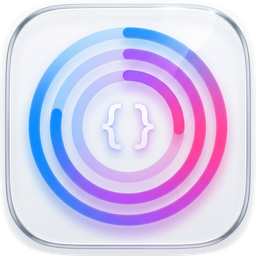

<div align="center">
  
  
  # GnomeCodexBar
  
  跨平台顶栏工具，实时监控 DeepSeek 和 StepFun 编程套餐用量
  
  
  
  
  
  
  ---
  
  🖥️ 顶栏实时显示 &nbsp;|&nbsp; 📊 进度条 + 详情弹窗 &nbsp;|&nbsp; 🔄 自动刷新 &nbsp;|&nbsp; 🌙 暗色主题 &nbsp;|&nbsp; 🚀 开机自启
  
</div>

## 功能

- **顶栏实时显示**：在顶栏显示当前用量（DeepSeek 显示余额，StepFun 显示剩余百分比）
- **弹出详情窗口**：点击顶栏控件查看详细信息，包括套餐名称、5h/周用量、重置时间、进度条等
- **多 Provider 切换**：在 DeepSeek 和 StepFun 之间一键切换顶栏显示
- **自动刷新**：CLI daemon 定时拉取最新数据，前端通过文件监听实时更新
- **DeepSeek**：显示账户余额（支持 CNY/USD）
- **StepFun**：显示套餐名称（Plus/Mini 等）、5h 窗口和周窗口剩余百分比、重置倒计时
- **跨平台**：Linux (GNOME Shell Extension) + macOS (SwiftUI Menu Bar App)

## 架构

```
┌─────────────────────┐        ┌──────────────────────┐
│   Rust CLI daemon   │───────▶│     status.json      │◀──── 文件监听
│  (定时拉取 API 数据)  │        │  ~/.local/share/     │
└─────────────────────┘        │  gnome-codex-bar/    │
                               └──────────────────────┘
                                        │
                          ┌─────────────┴─────────────┐
                          ▼                           ▼
                 ┌──────────────────┐       ┌──────────────────┐
                 │ GNOME Shell 扩展  │       │ macOS Menu Bar   │
                 │ (Gio.FileMonitor)│       │ (DispatchSource) │
                 └──────────────────┘       └──────────────────┘
```

数据流：Rust CLI → `status.json` → 前端通过文件监听自动刷新 UI。

## 安装

### 前置条件

- Rust 工具链（`rustup`）
- GNOME Shell 45 / 46 / 47 / 48
- `glib-compile-schemas`（通常随 `glib2-devel` 安装）

### 一键安装

**Linux (ZorinOS)：**

```bash
./install-linux.sh
```

安装脚本会：
1. 编译 Rust CLI 并安装到 `~/.local/bin/`
2. 将 GNOME Shell 扩展安装到 `~/.local/share/gnome-shell/extensions/`
3. 编译并安装 GSettings schema
4. 验证安装结果

**macOS：**

```bash
./install-macos.sh
```

安装脚本会：
1. 编译 Rust CLI 并安装到 `/usr/local/bin/`
2. 编译 SwiftUI 菜单栏应用并安装到 `~/Applications/CodexBar.app`
3. 验证安装结果

> macOS 使用原生 SwiftUI Menu Bar App，通过 `DispatchSource` 监听 `status.json` 变化自动刷新。

### 手动安装

**Linux：**

```bash
# 编译 CLI
cd cli && cargo build --release
cp target/release/codex-bar-cli ~/.local/bin/

# 安装扩展
cp -r gnome-shell-extension/* ~/.local/share/gnome-shell/extensions/codex-bar@gnome/

# 编译 schema
glib-compile-schemas ~/.local/share/glib-2.0/schemas/
```

**macOS：**

```bash
# 编译 CLI
cd cli && cargo build --release
cp target/release/codex-bar-cli /usr/local/bin/

# 编译并安装菜单栏应用
cd ../macos-bar && swift build -c release
# 安装到 ~/Applications/CodexBar.app（参考 install-macos.sh）
```

## 配置

配置文件位于 `~/.config/codex-bar/config.toml`，也可通过 CLI 命令配置：

### DeepSeek

```bash
codex-bar-cli config deepseek --api-key <YOUR_API_KEY>
```

### StepFun

```bash
codex-bar-cli config stepfun --username <EMAIL> --password <PASSWORD>
```

### 启用/禁用 Provider

```bash
codex-bar-cli config deepseek --enabled false
codex-bar-cli config stepfun --enabled true
```

### 示例 config.toml

```toml
[providers.deepseek]
enabled = true
api_key = "sk-xxx"

[providers.stepfun]
enabled = true
username = "user@example.com"
password = "your-password"

[general]
refresh_interval_secs = 300
selected_provider = "deepseek"
```

## 使用

```bash
# 单次拉取数据
codex-bar-cli fetch

# 启动守护进程（定时刷新，默认 5 分钟）
codex-bar-cli daemon &

# 查看当前状态
codex-bar-cli status

# 切换顶栏显示的 Provider
codex-bar-cli select stepfun

# 设置月度预算
codex-bar-cli budget 100
```

启动 daemon 后，在 GNOME 中启用扩展：

```bash
gnome-extensions enable codex-bar@gnome
```

或通过 GNOME Extensions 应用启用。

> **注意**：X11 下按 `Alt+F2` 输入 `r` 重启 Shell；Wayland 下需注销重新登录。

## CLI 命令

| 命令 | 说明 |
|------|------|
| `codex-bar-cli config <provider> [options]` | 配置 Provider |
| `codex-bar-cli fetch` | 单次拉取用量数据 |
| `codex-bar-cli daemon` | 启动守护进程定时刷新 |
| `codex-bar-cli status` | 显示当前状态 |
| `codex-bar-cli budget <amount>` | 设置月度预算 |
| `codex-bar-cli select <provider>` | 切换顶栏显示的 Provider |
| `codex-bar-cli autostart enable` | 启用开机自启动守护进程 |
| `codex-bar-cli autostart disable` | 禁用开机自启动 |
| `codex-bar-cli autostart status` | 查看自启动状态 |

## 开机自启动

CLI 支持开机自启动守护进程，自动检测平台：

```bash
# 启用开机自启动
codex-bar-cli autostart enable

# 禁用开机自启动
codex-bar-cli autostart disable

# 查看自启动状态
codex-bar-cli autostart status
```

| 平台 | 机制 | 说明 |
|------|------|------|
| Linux (ZorinOS) | systemd user service | `After=network-online.target`，`Restart=on-failure` |
| macOS | launchd plist | `KeepAlive=true`，日志输出到 `~/.local/share/gnome-codex-bar/logs/` |

## 测试

```bash
# 一键运行测试 + 覆盖率报告
./test.sh

# 仅运行测试（跳过覆盖率）
./test.sh --no-cov

# 手动运行
cd cli && cargo test

# 生成 HTML 覆盖率报告
cd cli && cargo llvm-cov --html --open
```

### 测试架构

测试代码集中在 `cli/tests/unit/` 目录（与 `src/` 同级），源文件通过 `#[path]` 属性引用：

```
cli/
├── src/                            # 源代码
│   ├── config.rs                   # #[cfg(test)] #[path = "../tests/unit/config.rs"] mod tests;
│   ├── output.rs                   # #[cfg(test)] #[path = "../tests/unit/output.rs"] mod tests;
│   └── providers/
│       ├── mod.rs                  # #[cfg(test)] #[path = "../../tests/unit/providers_mod.rs"] mod tests;
│       ├── deepseek.rs             # #[cfg(test)] #[path = "../../tests/unit/providers_deepseek.rs"] mod tests;
│       └── stepfun.rs              # #[cfg(test)] #[path = "../../tests/unit/providers_stepfun.rs"] mod tests;
└── tests/
    └── unit/                       # 所有测试文件（unit/ 子目录避免 Cargo 集成测试冲突）
        ├── config.rs
        ├── output.rs
        ├── providers_mod.rs
        ├── providers_deepseek.rs
        └── providers_stepfun.rs
```

这种方式的优点：测试代码集中管理、源文件保持简洁、测试仍可访问私有类型（无需改为 `pub`）。

### 测试覆盖

| 模块 | 测试数 | 覆盖内容 |
|------|--------|---------|
| `config.rs` | 6 | 配置默认值、TOML 序列化/反序列化、Provider 配置映射 |
| `output.rs` | 4 | StatusSnapshot 序列化、selected_provider 读写 |
| `providers/mod.rs` | 6 | ProviderStatus/StatusSnapshot 序列化、error 字段 |
| `providers/deepseek.rs` | 6 | Balance API 响应解析、余额逻辑、Provider id/name |
| `providers/stepfun.rs` | 25 | 灵活类型反序列化、parse_timestamp、build_status、extract_set_cookie |
| `autostart.rs` | 8 | 平台检测、systemd/launchd 路径、service/plist 内容生成 |

共 55 个单元测试，覆盖所有纯逻辑函数（网络请求需 mock，暂未覆盖）。

## 项目结构

```
GnomeCodexBar/
├── cli/                          # Rust CLI 后端
│   ├── src/
│   │   ├── main.rs               # CLI 入口 & 子命令
│   │   ├── daemon.rs             # 守护进程循环
│   │   ├── autostart.rs          # 开机自启动 (systemd/launchd)
│   │   ├── config.rs             # 配置加载 (TOML)
│   │   ├── output.rs             # 写入 status.json
│   │   └── providers/
│   │       ├── mod.rs            # Provider trait & 共享类型
│   │       ├── deepseek.rs       # DeepSeek 余额 API
│   │       └── stepfun.rs        # StepFun 登录 + 用量 + 套餐 API
│   └── tests/
│       └── unit/                 # 单元测试（与 src/ 同级）
│           ├── config.rs
│           ├── output.rs
│           ├── providers_mod.rs
│           ├── providers_deepseek.rs
│           ├── providers_stepfun.rs
│           └── autostart.rs
├── gnome-shell-extension/        # GNOME Shell 扩展前端 (Linux)
│   ├── extension.js              # 主扩展（顶栏按钮 + 弹出窗口）
│   ├── popupMenu.js              # PopupMenu 版弹出窗口
│   ├── panelButton.js            # 顶栏按钮渲染
│   ├── statusReader.js           # 读取 status.json + 文件监听
│   ├── stylesheet.css            # 样式
│   ├── prefs.js                  # 偏好设置
│   ├── metadata.json             # 扩展元数据
│   └── schemas/                  # GSettings schema
├── macos-bar/                    # macOS 菜单栏应用前端
│   ├── Package.swift             # Swift Package Manager 配置
│   └── Sources/
│       ├── CodexBarApp.swift     # @main 入口 + MenuBarExtra
│       ├── StatusReader.swift    # 读取 status.json + 文件监听
│       ├── Models.swift          # 数据模型 (StatusSnapshot/ProviderStatus)
│       ├── PopoverContent.swift  # 弹出窗口内容
│       ├── ProviderCardView.swift # Provider 卡片视图
│       └── BarSection.swift      # 进度条区域
├── install-linux.sh               # Linux 一键安装脚本
├── install-macos.sh               # macOS 一键安装脚本
└── test.sh                       # 一键测试脚本
```

## License

MIT
